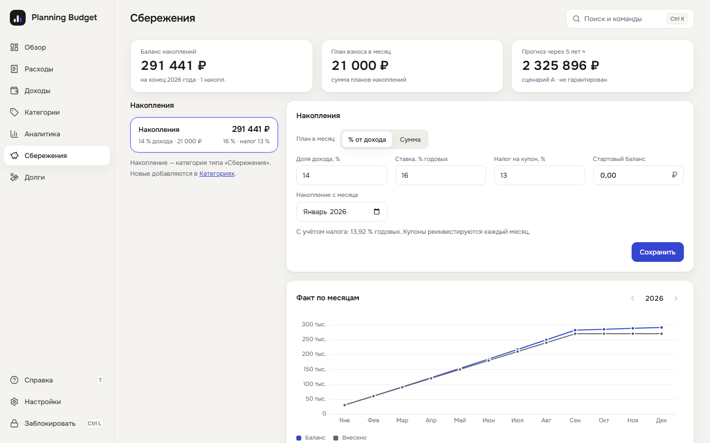
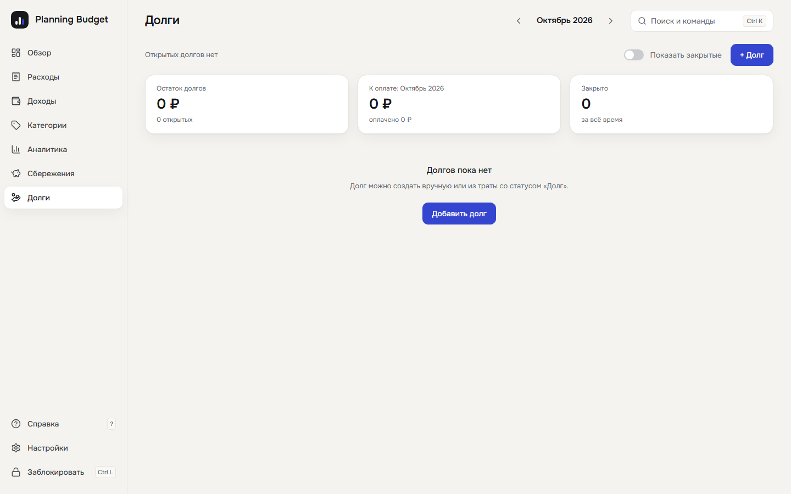

# Planning Budget

Настольное приложение для учёта личных финансов. Расходы по категориям с лимитами, доходы, сбережения, долги с графиком погашений, аналитика с настраиваемыми графиками, накопления (в том числе облигации) с прогнозом. Все данные лежат только на вашем компьютере в зашифрованной базе. Интернет приложению не нужен и не используется.


<table>
  <tr>
    <td></td>
    <td></td>
  </tr>
  <tr>
    <td></td>
    <td></td>
  </tr>
  <tr>
    <td></td>
    <td></td>
  </tr>
</table>

## Возможности

- **Расходы и доходы по месяцам.** Блоки по категориям или таблица, статусы трат (оплачено, долг, незапланировано, план), быстрое добавление клавишей **N** (расходы) и **I** (доходы).
- **Категории и лимиты.** Свой набор категорий, лимиты с историей по месяцам, процент плана сбережений.
- **Поиск и фильтры.** Строка поиска по тратам с условиями (`статус:оплачено`, `сумма>5000`, `период:июн..сен`, `#тег`), сохранённые фильтры, палитра команд **Ctrl K** (на macOS ⌘ K).
- **Аналитика.** Настраиваемые графики и дашборды: период, показатель, разбивка, фильтр.
- **План месяца.** Доход распределяется по статьям, сбережениям и погашениям; «Не распределено», «План готов», план и факт по статьям.
- **Долги.** Заём, график погашения, создание долга из траты со статусом «Долг».
- **Сбережения.** Несколько накоплений: план процентом или суммой, ставка и налог, баланс по месяцам и прогноз на пять лет в трёх сценариях.
- **Светлая и тёмная тема, масштаб интерфейса, режим «меньше анимаций».**

## Безопасность и приватность

- Данные хранятся в одном файле `budget.db`, зашифрованном SQLCipher (AES-256). Ключ защищён вашим паролем (Argon2id) и ключом восстановления.
- Приложение не обращается к сети: ни телеметрии, ни обновлений, ни внешних шрифтов.
- Автоблокировка по бездействию, блокировка по **Ctrl L** и (по желанию) при сворачивании окна.
- Три неверных пароля подряд включают нарастающую задержку. Данные при этом не удаляются.

## Установка

Готовые установщики для Windows, macOS и Linux лежат на странице [Releases](../../releases). Скачайте файл для своей системы и запустите его. Установщики пока не подписаны, поэтому Windows SmartScreen и macOS Gatekeeper покажут предупреждение о неизвестном издателе: его нужно подтвердить вручную.

## Первый запуск

1. Придумайте пароль (не короче 10 символов). Приложение покажет **ключ восстановления** из 26 символов. Сохраните его в надёжном месте отдельно от компьютера.
2. Приложение коротко расскажет, как оно устроено (пять экранов, можно пропустить), и предложит мастер первого месяца. Знакомство можно показать снова в «Настройки → Вид».
3. В «Категориях» уже есть набор стандартных категорий без лимитов: задайте лимиты, переименуйте категории или добавьте свои.

## Как пользоваться

Приложение построено вокруг плана месяца.

1. **Доход.** Внесите ожидаемые поступления месяца в «Доходах»; по мере получения отмечайте их полученными.
2. **План.** Распределите доход: плановые траты по статьям (статус «План»), накопления в «Сбережениях» (процентом от дохода или суммой), погашения долгов из «Долгов». Главная цифра экрана «Обзор» — **«Не распределено»**: цель 0 ₽, отрицательное значение означает, что план превышает доход. Для первого месяца есть мастер: он спрашивает доход, суммы по статьям и накопления. Новый месяц можно начать кнопкой «Скопировать план из прошлого месяца».
3. **План готов.** Когда всё распределено, нажмите «План готов»: приложение запомнит плановые суммы. Позже план можно разблокировать и поправить.
4. **В течение месяца** отмечайте, что произошло: «Оплачено», «Долг» (оплачено заёмными деньгами, из такой траты можно сразу создать долг с графиком погашения), «Незапланировано». Траты, добавленные после «План готов», по умолчанию получают статус «Незапланировано».
5. **Итоги.** В «Обзоре» для каждой статьи видно план, факт и отклонение, а также незапланированное, взятое в долг и отложенное.

Погашение долга не считается расходом: оно уменьшает свободные деньги месяца, но не попадает в лимит статьи. Справка с тем же рассказом и списком горячих клавиш открывается клавишей **?** (пункт «Справка» в меню); знакомство при первом запуске можно показать снова в «Настройки → Вид».


## Где лежат данные

| Система | Папка |
|---|---|
| Windows | `%APPDATA%\planning-budget` |
| macOS | `~/Library/Application Support/planning-budget` |
| Linux | `~/.local/share/planning-budget` |

В папке лежат `budget.db` (вся база), `vault.json` (ключи: пароль и ключ восстановления оборачивают ключ базы), `ui-prefs.json` (тема, масштаб, подсказки) и `logs/` (журнал работы: только коды и тайминги, без сумм, названий и паролей).

Если у вас стоял Private Budget (папка `private-budget`), при первом запуске сейф, база, настройки и резервные копии копируются в новую папку; старая остаётся нетронутой, и её можно удалить вручную после проверки.

## Резервные копии

Автоматических копий, экспорта и импорта выписок пока нет. Чтобы сделать копию, закройте приложение и скопируйте **вместе** `budget.db` и `vault.json` в безопасное место: без второго файла первый не открыть. Копия остаётся зашифрованной и открывается тем паролем, который действовал на момент копирования.

## Что будет, если потерять пароль

- Забыли пароль, но есть ключ восстановления: на экране входа выберите «Забыли пароль? Ключ восстановления», введите ключ и задайте новый пароль. Данные сохранятся.
- Потеряны и пароль, и ключ восстановления: **данные восстановить нельзя**. Это следствие шифрования, обходного пути нет.

## Известные ограничения

- Защита рассчитана на потерю или кражу компьютера и на доступ других людей к файлам. От вредоносных программ на разблокированном компьютере, перехвата клавиатуры и принуждения она не защищает.
- Пароль и ключ восстановления передаются из окна приложения во внутренний процесс обычной строкой, и их копии в памяти не затираются до выхода из приложения.
- «Удалить все данные» затирает файлы нулями перед удалением, но на SSD и в файловых системах с копированием при записи физическое стирание это не гарантирует.
- Блокировка при сворачивании окна проверена на Windows. На macOS и Linux сворачивание может не распознаваться, тогда сейф остаётся открытым до таймера бездействия.
- Два одновременно запущенных экземпляра работают с одними и теми же файлами независимо: блокировка в одном окне не закрывает другое. Запускайте один экземпляр.

## Сборка из исходников

Нужны [Rust](https://rustup.rs), Node.js 24 и pnpm.

```bash
pnpm install
pnpm tauri build
```

На Linux перед сборкой установите `libwebkit2gtk-4.1-dev`, `libssl-dev` и `librsvg2-dev`. На Windows для сборки SQLCipher нужен Strawberry Perl.

## Лицензия

[MIT](LICENSE)
